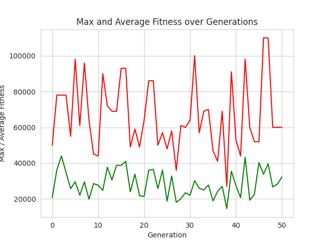

# TO-DO list

- [ ] logger decorator
- [ ] move inside classes defoult used methods, like here:

```python
class This:

    def __init__(self):
        self.items = []
        self.__init_data()

    def __init_data(self):
        self.items = [... do somethings importent...]
```

- [ ] **use multiprocessing for evaluate function** (test example of learning 13153.485339403152)
- [ ] change and test crossower method (now it simple stohastic)



- [ ] more precision for board data
  - [ ] collision calculation for units
  - [ ] calculate resource coldown needed for cities and workers for nonstohastic resource storage
