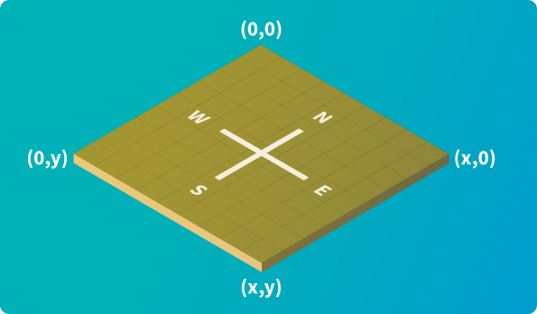

# Lux AI Season 1 Specifications

[Сет последних изменеений](https://www.kaggle.com/c/lux-ai-2021/discussion/269544)

## Background

The night is dark and full of terrors. Two teams must fight off the darkness, collect resources, and advance through the ages. Daytime finds a desperate rush to gather and build the resources that can carry you through the impending night. Plan and expand carefully -- any city that fails to produce enough light will be consumed by darkness.

Ночь темна и полна ужасов. Две команды должны бороться с тьмой, собирать ресурсы и продвигаться сквозь века. Дневное время наполняется отчаянным стремлением собрать и накапливать ресурсы, которые помогут вам пережить надвигающуюся ночь. Тщательно планируйте и расширяйте - любой город, который не дает достаточно света, будет поглощен тьмой.

## Environment

In the Lux AI Challenge Season 1, two competing teams control a team of Units and CityTiles that collect resources to fuel their Cities, with the main objective to own as many CityTiles as possible at the end of the turn-based game. Both teams have complete information about the entire game state and will need to make use of that information to optimize resource collection, compete for scarce resources against the opponent, and build cities to gain points.

Each competitor must program their own agent in their language of choice. Each turn, your agent gets 3 seconds to submit their actions, excess time is not saved across turns. In each game, you are given a pool of 60 seconds that is tapped into each time you go over a turn's 3-second limit. Upon using up all 60 seconds and going over the 3-second limit, your agent freezes and can no longer submit additional actions.

The rest of the document will go through the key features of this game.

В первом сезоне Lux AI Challenge две соревнующиеся команды управляют командой юнитов и CityTiles, которые собирают ресурсы для подпитки своих городов, с основной целью владеть как можно большим количеством CityTiles в конце пошаговой игры. Обе команды имеют полную информацию обо всем состоянии игры и должны будут использовать эту информацию для оптимизации сбора ресурсов, борьбы за ограниченные ресурсы с противником и строительства городов, чтобы набирать очки.

Каждый участник должен запрограммировать своего агента на выбранном им языке. **Каждый ход ваш агент получает 3 секунды на то, чтобы представить свои действия, лишнее время не сохраняется между ходами. В каждой игре вам дается 60 секунд, которые используются каждый раз, когда вы превышаете 3-секундный лимит хода. После использования всех 60 секунд и превышения 3-секундного лимита ваш агент зависает и больше не может отправлять дополнительные действия**.

В оставшейся части документа будут рассмотрены ключевые особенности этой игры.

## The Map

The world of Lux is represented as a 2d grid. Coordinates increase east (right) and south (down). The map is always a square and can be 12, 16, 24, or 32 tiles long. The (0, 0) coordinate is at the top left.

The map has various features including Resources (Wood, Coal, Uranium), Units (Workers, Carts), CityTiles, and Road.

In order to prevent maps from favoring one player over another, it is guaranteed that maps are always symmetric by vertical or horizontal reflection.

Each player will start with a single CityTile and a single worker on that CityTile

Мир Lux представлен в виде 2-мерной сетки. **Координаты увеличиваются на восток (справа) и на юг (вниз)**. Карта **всегда представляет собой квадрат и может иметь длину 12, 16, 24 или 32 плитки.** Координата (0, 0) находится вверху слева.

Карта имеет различные функции, включая ресурсы (древесина, уголь, уран), юниты (рабочие, тележки), плитки города и дороги.

Чтобы карты не отдавали предпочтение одному игроку над другим, гарантируется, что **карты всегда симметричны по вертикальному или горизонтальному отражению**.

Каждый игрок будет начинать с одного CityTile и одного рабочего на этом CityTile.

## Resources

There are 3 kinds of resources: Wood, Coal, and Uranium (in order of increasing fuel efficiency). These resources are collected by workers, then dropped off once a worker moves on top of a CityTile to then be converted into fuel for the city. Some resources require research points before they are possible to collect.

Wood in particular can regrow. Each turn, every wood tile's wood amount increases by 2.5% of its current wood amount rounded up. Wood tiles that have been depleted will not regrow. Only wood tiles with less than 500 wood will regrow.

| Resource Type | Research PointsPre-requisite | Fuel Valueper Unit | Units Collectedper Turn |
|---------------|------------------------------|--------------------|-------------------------|
| Wood          | 0                            | 1                  | 20                      |
| Coal          | 50                           | 10                 | 5                       |
| Uranium       | 200                          | 40                 | 2                       |

Есть 3 вида ресурсов: древесина, уголь и уран (в порядке увеличения эффективности использования топлива). Эти ресурсы собираются рабочими, а затем сбрасываются, когда рабочий перемещается на вершину CityTile, а затем превращаются в топливо для города. Некоторые ресурсы требуют очков исследования, прежде чем их можно будет собрать.

В частности, древесина может вырасти заново. Каждый ход количество древесины каждой деревянной плитки увеличивается на 2,5% от текущего количества древесины, округленного в большую сторону. Полностью выработанная деревянная плитка не вырастет заново. Только деревянные плитки с менее чем 500 древесины будут расти заново.

### Collection Mechanics

At the end of each turn, Workers automatically receive resources from all adjacent (North, East, South, West, or Center) resource tiles they can collect resources from according to the current symmetric formula:

- Iterating over uranium, coal, then wood resources:

  - Each unit makes resource collection requests to collect an even number of resources from each adjacent tile of the current iterated resource such that the collected amount takes the unit's cargo above capacity. E.g. worker with 60 wood adjacent to 3 wood tiles asks for 14 from each, receives 40 wood, and wastes 2.
  - All tiles of the current iterated resource then try to fulfill requests, if they can't they make sure all unfulfilled requests get an equal amount, the leftover is wasted. E.g. if 4 workers are mining a tile of 25 wood, but one of them is only asking for 5 while the others are asking for 20 wood each, then first all workers get 5 wood each, leaving 5 wood left over for 3 more workers with space left. This can evenly be distributed by giving 1 wood each to the last 3 workers, leaving 2 wood left that is then wasted.
  
Workers cannot mine while on CityTiles. Instead, if there is at least one Worker on a CityTile, that CityTile will automatically collect adjacent resources at the same rate as a worker each turn and directly convert it all to fuel. The collection mechanic for a CityTile is the same as a worker and you can treat a CityTile as an individual Worker collecting resources.

В конце каждого хода Рабочие автоматически получают ресурсы со всех смежных (север, восток, юг, запад или центр) ресурсных плиток, с которых они могут собирать ресурсы в соответствии с текущей симметричной формулой:

- Итерация по урану, углю, затем по древесным ресурсам:

  - Каждый юнит делает запросы на сбор ресурсов, чтобы собрать четное количество ресурсов из каждой смежной плитки текущего повторяемого ресурса, так что собранная сумма не превышает емкость юнита. Например. Рабочий с 60 деревом, примыкающим к 3 деревянным плиткам, просит по 14 с каждой, получает 40 дерева и тратит 2.
  - Все плитки текущего итерационного ресурса затем пытаются выполнить запросы, и если они не могут убедиться, что все невыполненные запросы получают равное количество, остаток тратится впустую. Например. если 4 рабочих добывают плитку из 25 дерева, но один из них просит только 5, а другие просят 20 древесины каждый, то сначала все рабочие получают по 5 древесины, оставляя 5 древесины. Остаток будет распределен равномерно по 1 дереву последним трем рабочим, а 2 дерева будут потрачены впустую.
  
Рабочие не могут майнить, находясь на CityTiles. Вместо этого, если есть хотя бы один рабочий на CityTile, этот CityTile будет автоматически собирать смежные ресурсы с той же скоростью, что и рабочий каждый ход, и напрямую преобразовывать их в топливо. Механика сбора CityTile такая же, как у рабочего, и вы можете рассматривать CityTile как отдельного рабочего, собирающего ресурсы.

## Actions

Units and CityTiles can perform actions each turn given certain conditions. In general, all actions are simultaneously applied and are validated against the state of the game at the start of a turn. The next few sections describe the Units and CityTiles in detail.

Юниты и CityTiles могут выполнять действия каждый ход при определенных условиях. Как правило, все действия применяются одновременно и проверяются относительно состояния игры в начале хода. В следующих нескольких разделах подробно описываются Units и CityTiles.

## CityTiles

A CityTile is a building that takes up one tile of space. Adjacent CityTiles collectively form a City. Each CityTile can perform a single action provided the CityTile has a Cooldown < 1.

Actions

- Build Worker - Build Worker unit on top of this CityTile (cannot build a worker if the current number of owned workers + carts equals the number of owned CityTiles)
- Build Cart - Build Carts unit on top of this CityTile (cannot build a cart if the current number of owned workers + carts equals the number of owned CityTiles)
- Research - Increase your team’s Research Points by 1

CityTile - это здание, занимающее одну клетку пространства. Соседние CityTiles вместе образуют город. Каждый CityTile может выполнять одно действие, если время восстановления CityTile Cooldown < 1.

Действия

- Build Worker - Постройте рабочего в этом CityTile (не может построить рабочего, если текущее количество собственных рабочих + тележек равно количеству принадлежащих CityTiles)
- Build Cart - Постройте тележку в этом  CityTile (невозможно построить тележку, если текущее количество собственных рабочих + тележек равно количеству принадлежащих CityTiles)
- Research - увеличьте очки исследования своей команды на 1

