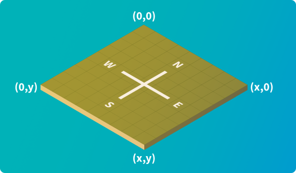

# Lux AI Season 1 Specifications

[Сет последних изменеений](https://www.kaggle.com/c/lux-ai-2021/discussion/269544)

## Background

The night is dark and full of terrors. Two teams must fight off the darkness, collect resources, and advance through the ages. Daytime finds a desperate rush to gather and build the resources that can carry you through the impending night. Plan and expand carefully -- any city that fails to produce enough light will be consumed by darkness.

Ночь темна и полна ужасов. Две команды должны бороться с тьмой, собирать ресурсы и продвигаться сквозь века. Дневное время наполняется отчаянным стремлением собрать и накапливать ресурсы, которые помогут вам пережить надвигающуюся ночь. Тщательно планируйте и расширяйте - любой город, который не дает достаточно света, будет поглощен тьмой.

## Environment

In the Lux AI Challenge Season 1, two competing teams control a team of Units and CityTiles that collect resources to fuel their Cities, with the main objective to own as many CityTiles as possible at the end of the turn-based game. Both teams have complete information about the entire game state and will need to make use of that information to optimize resource collection, compete for scarce resources against the opponent, and build cities to gain points.

Each competitor must program their own agent in their language of choice. Each turn, your agent gets 3 seconds to submit their actions, excess time is not saved across turns. In each game, you are given a pool of 60 seconds that is tapped into each time you go over a turn's 3-second limit. Upon using up all 60 seconds and going over the 3-second limit, your agent freezes and can no longer submit additional actions.

The rest of the document will go through the key features of this game.

В первом сезоне Lux AI Challenge две соревнующиеся команды управляют командой юнитов и CityTiles, которые собирают ресурсы для подпитки своих городов, с основной целью владеть как можно большим количеством CityTiles в конце пошаговой игры. Обе команды имеют полную информацию обо всем состоянии игры и должны будут использовать эту информацию для оптимизации сбора ресурсов, борьбы за ограниченные ресурсы с противником и строительства городов, чтобы набирать очки.

Каждый участник должен запрограммировать своего агента на выбранном им языке. **Каждый ход ваш агент получает 3 секунды на то, чтобы представить свои действия, лишнее время не сохраняется между ходами. В каждой игре вам дается 60 секунд, которые используются каждый раз, когда вы превышаете 3-секундный лимит хода. После использования всех 60 секунд и превышения 3-секундного лимита ваш агент зависает и больше не может отправлять дополнительные действия**.

В оставшейся части документа будут рассмотрены ключевые особенности этой игры.

## The Map

The world of Lux is represented as a 2d grid. Coordinates increase east (right) and south (down). The map is always a square and can be 12, 16, 24, or 32 tiles long. The (0, 0) coordinate is at the top left.

The map has various features including Resources (Wood, Coal, Uranium), Units (Workers, Carts), CityTiles, and Road.

In order to prevent maps from favoring one player over another, it is guaranteed that maps are always symmetric by vertical or horizontal reflection.

Each player will start with a single CityTile and a single worker on that CityTile

Мир Lux представлен в виде 2-мерной сетки. **Координаты увеличиваются на восток (справа) и на юг (вниз)**. Карта **всегда представляет собой квадрат и может иметь длину 12, 16, 24 или 32 плитки.** Координата (0, 0) находится вверху слева.

Карта имеет различные функции, включая ресурсы (древесина, уголь, уран), юниты (рабочие, тележки), плитки города и дороги.

Чтобы карты не отдавали предпочтение одному игроку над другим, гарантируется, что **карты всегда симметричны по вертикальному или горизонтальному отражению**.

Каждый игрок будет начинать с одного CityTile и одного рабочего на этом CityTile.

## Resources

There are 3 kinds of resources: Wood, Coal, and Uranium (in order of increasing fuel efficiency). These resources are collected by workers, then dropped off once a worker moves on top of a CityTile to then be converted into fuel for the city. Some resources require research points before they are possible to collect.

Wood in particular can regrow. Each turn, every wood tile's wood amount increases by 2.5% of its current wood amount rounded up. Wood tiles that have been depleted will not regrow. Only wood tiles with less than 500 wood will regrow.

| Resource Type | Research PointsPre-requisite | Fuel Valueper Unit | Units Collected per Turn |
|---------------|------------------------------|--------------------|-------------------------|
| Wood          | 0                            | 1                  | 20                      |
| Coal          | 50                           | 10                 | 5                       |
| Uranium       | 200                          | 40                 | 2                       |

Есть 3 вида ресурсов: древесина, уголь и уран (в порядке увеличения эффективности использования топлива). Эти ресурсы собираются рабочими, а затем сбрасываются, когда рабочий перемещается на вершину CityTile, а затем превращаются в топливо для города. Некоторые ресурсы требуют очков исследования, прежде чем их можно будет собрать.

В частности, древесина может вырасти заново. Каждый ход количество древесины каждой деревянной плитки увеличивается на 2,5% от текущего количества древесины, округленного в большую сторону. Полностью выработанная деревянная плитка не вырастет заново. Только деревянные плитки с менее чем 500 древесины будут расти заново.

### Collection Mechanics

At the end of each turn, Workers automatically receive resources from all adjacent (North, East, South, West, or Center) resource tiles they can collect resources from according to the current symmetric formula:

- Iterating over uranium, coal, then wood resources:

  - Each unit makes resource collection requests to collect an even number of resources from each adjacent tile of the current iterated resource such that the collected amount takes the unit's cargo above capacity. E.g. worker with 60 wood adjacent to 3 wood tiles asks for 14 from each, receives 40 wood, and wastes 2.
  - All tiles of the current iterated resource then try to fulfill requests, if they can't they make sure all unfulfilled requests get an equal amount, the leftover is wasted. E.g. if 4 workers are mining a tile of 25 wood, but one of them is only asking for 5 while the others are asking for 20 wood each, then first all workers get 5 wood each, leaving 5 wood left over for 3 more workers with space left. This can evenly be distributed by giving 1 wood each to the last 3 workers, leaving 2 wood left that is then wasted.
  
Workers cannot mine while on CityTiles. Instead, if there is at least one Worker on a CityTile, that CityTile will automatically collect adjacent resources at the same rate as a worker each turn and directly convert it all to fuel. The collection mechanic for a CityTile is the same as a worker and you can treat a CityTile as an individual Worker collecting resources.

В конце каждого хода Рабочие автоматически получают ресурсы со всех смежных (север, восток, юг, запад или центр) ресурсных плиток, с которых они могут собирать ресурсы в соответствии с текущей симметричной формулой:

- Итерация по урану, углю, затем по древесным ресурсам:

  - Каждый юнит делает запросы на сбор ресурсов, чтобы собрать четное количество ресурсов из каждой смежной плитки текущего повторяемого ресурса, так что собранная сумма не превышает емкость юнита. Например. Рабочий с 60 деревом, примыкающим к 3 деревянным плиткам, просит по 14 с каждой, получает 40 дерева и тратит 2.
  - Все плитки текущего итерационного ресурса затем пытаются выполнить запросы, и если они не могут убедиться, что все невыполненные запросы получают равное количество, остаток тратится впустую. Например. если 4 рабочих добывают плитку из 25 дерева, но один из них просит только 5, а другие просят 20 древесины каждый, то сначала все рабочие получают по 5 древесины, оставляя 5 древесины. Остаток будет распределен равномерно по 1 дереву последним трем рабочим, а 2 дерева будут потрачены впустую.
  
Рабочие не могут майнить, находясь на CityTiles. Вместо этого, если есть хотя бы один рабочий на CityTile, этот CityTile будет автоматически собирать смежные ресурсы с той же скоростью, что и рабочий каждый ход, и напрямую преобразовывать их в топливо. Механика сбора CityTile такая же, как у рабочего, и вы можете рассматривать CityTile как отдельного рабочего, собирающего ресурсы.

## Actions

Units and CityTiles can perform actions each turn given certain conditions. In general, all actions are simultaneously applied and are validated against the state of the game at the start of a turn. The next few sections describe the Units and CityTiles in detail.

Юниты и CityTiles могут выполнять действия каждый ход при определенных условиях. Как правило, все действия применяются одновременно и проверяются относительно состояния игры в начале хода. В следующих нескольких разделах подробно описываются Units и CityTiles.

## CityTiles

A CityTile is a building that takes up one tile of space. Adjacent CityTiles collectively form a City. Each CityTile can perform a single action provided the CityTile has a Cooldown < 1.

Actions

- Build Worker - Build Worker unit on top of this CityTile (cannot build a worker if the current number of owned workers + carts equals the number of owned CityTiles)
- Build Cart - Build Carts unit on top of this CityTile (cannot build a cart if the current number of owned workers + carts equals the number of owned CityTiles)
- Research - Increase your team’s Research Points by 1

CityTile - это здание, занимающее одну клетку пространства. Соседние CityTiles вместе образуют город. Каждый CityTile может выполнять одно действие, если время восстановления CityTile Cooldown < 1.

Действия

- Build Worker - Постройте рабочего в этом CityTile (не может построить рабочего, если текущее количество собственных рабочих + тележек равно количеству CityTiles)
- Build Cart - Постройте тележку в этом  CityTile (невозможно построить тележку, если текущее количество собственных рабочих + тележек равно количеству CityTiles)
- Research - увеличьте очки исследования своей команды на 1

## Units

There are two unit types, Workers, and Carts. Every unit can perform a single action once they have a Cooldown < 1.

All units can choose the move action and move in any of 5 directions, North, East, South, West, Center. Moreover, all units can carry raw resources gained from automatic mining or resource transfer. Workers are capped at 100 units of resources and Carts are capped at 2000 units of resources.

Whenever a unit moves on top of a friendly CityTile, the City that CityTile forms converts all carried resources into fuel.

There can be at most one unit on tiles without a CityTile. Moreover, units cannot move on top of the opposing team’s CityTiles. However, units can stack on top of each other on a friendly CityTile.

If two units attempt to move to the same tile that is not a CityTile, this is considered a collision, and the move action is canceled.

Есть два типа юнитов: рабочие и тележки. Каждый юнит может выполнить одно действие, если он имеет Cooldown < 1.

Все юниты могут выбрать действие и двигаться в любом из 5 направлений: North, East, South, West, Center. Более того, все юниты могут нести ресурсы, полученные в результате автоматической добычи или передачи ресурсов. Рабочие ограничены 100 единицами ресурсов, а тележки ограничены 2000 единицами ресурсов.

Каждый раз, когда юнит перемещается на дружественный CityTile, CityTile превращает все переносимые ресурсы в топливо.

На плитках без CityTile может быть не более одного юнита. Более того, юниты не могут перемещаться поверх CityTiles противоположной команды. Однако юниты могут складываться друг на друга на дружественном CityTile.

Если два юнита пытаются переместиться на одну и ту же плитку, которая не является CityTile, это считается столкновением, и оба действия перемещения отменяется.

### Workers

Actions

- Move - Move the unit in one of 5 directions, North, East, South, West, Center.
- Pillage - Reduce the Road level of the tile the unit is on by 0.5
- Transfer - Send any amount of a single resource-type from a unit's cargo to another (start-of-turn) adjacent Unit, up to the latter's cargo capacity. Excess is returned to the original unit.
- Build CityTile - Build a CityTile right under this worker provided the worker has 100 total resources of any type in their cargo (full cargo) and the tile is empty. If building is successful, all carried resources are consumed and a new CityTile is built with 0 starting resources.

- Перемещение - перемещайте юнита в одном из 5 направлений: север, восток, юг, запад, центр.
- Грабеж - Уменьшите уровень дороги на тайле, на котором находится отряд, на 0,5
- Передача - отправьте любое количество одного типа ресурса из груза юнита другому (в начале хода) соседнему юниту, вплоть до грузоподъемности последнего. Излишек возвращается исходному юниту.
- Build CityTile - Создайте CityTile прямо под этим рабочим при условии, что у рабочего есть 100 ресурсов любого типа в загрузке (полная загрузка), а тайл пуст. Если строительство прошло успешно, все перенесенные ресурсы потребляются, и новый CityTile строится с нулевыми начальными ресурсами.

### Carts

Actions

- Move - Move the unit in one of 5 directions, North, East, South, West, Center.
- Transfer - Send any amount of a single resource-type from a unit's cargo to another (start-of-turn) adjacent Unit, up to the latter's cargo capacity. Excess is returned to the original unit.

- Перемещение - перемещайте юнит в одном из 5 направлений: север, восток, юг, запад, центр.
- Передача - отправьте любое количество одного типа ресурса из груза юнита другому (в начале хода) соседнему юниту, вплоть до грузоподъемности последнего. Излишек возвращается исходному юниту.

## Cooldown

CityTiles, Workers and Carts all have a cooldown mechanic after each action. Units and CityTiles can only perform an action when they have < 1 Cooldown.

At the end of each turn, after Road have been built and pillaged, each unit's Cooldown decreases by 1 and further decreases by the level of the Road the unit is on at the end of the turn. CityTiles are not affected by road levels and cooldown always decreases by 1. The minimum Cooldown is 0.

After an action is performed, the unit’s Cooldown will increase by a Base Cooldown.

| Unit Type | Base Cooldown |
|-----------|---------------|
| CityTile | 10 |
| Worker | 2 |
| Cart | 3 |

CityTiles, Workers и Carts имеют механику восстановления после каждого действия. Юниты и CityTiles могут выполнять действие, только если у них < 1 Cooldown.

В конце каждого хода, после того, как Road была построена и разграблена, время восстановления каждого юнита уменьшается на 1 и далее уменьшается в зависимости от уровня дороги, на которой он находится в конце хода. На CityTiles не влияют уровни дороги, и время восстановления всегда уменьшается на 1. Минимальное время восстановления - 0.

После выполнения действия время восстановления юнита увеличивается на базовое время восстановления.

## Roads

As Carts travel across the map, they start to create roads that allow all Units to move faster (see Cooldown). At the end of each turn, Cart will upgrade the road level of the tile it ends on by 0.75. The higher the road level, the faster Units can move and perform actions. All tiles start with a road level of 0 and are capped at 6.

Moreover, CityTiles automatically have the max road level of 6.

Roads can also be destroyed by Workers via the pillage action which reduces road level by 0.5 each time.

If a City is consumed by darkness, the road level of all tiles in the City's CityTiles will go back to 0.

По мере того как тележки перемещаются по карте, они начинают прокладывать дороги, которые позволяют всем отрядам двигаться быстрее (см. Cooldown). В конце каждого хода тележка будет повышать уровень дороги плитки, на которой она заканчивается, на 0,75. Чем выше уровень дороги, тем быстрее Юниты могут двигаться и выполнять действия. Все плитки начинаются с уровня дороги 0 и ограничиваются 6.

Более того, CityTiles автоматически имеет максимальный уровень дороги 6.

Рабочие также могут разрушить дороги с помощью грабежа, который каждый раз снижает уровень дороги на 0,5.

Если город поглощен тьмой, уровень дороги всех плиток в CityTiles вернется к 0.

## Day/Night Cycle

The Day/Night cycle consists of a 40 turn cycle, the first 30 turns being day turns, the last 10 being night turns. There are a total of 360 turns in a match, forming 9 cycles.

During the night, Units and Cities need to produce light to survive. Each turn of night, each Unit and CityTile will consume an amount of fuel, see table below for rates. Units in particular will use their carried resources to produce light whereas CityTiles will use their fuel to produce light.

Workers and Carts will only need to consume resources if they are not on a CityTile. When outside the City, Workers and Carts must consume whole units of resources to satisfy their night needs, e.g. if a worker carries 1 wood and 5 uranium on them, they will consume a full wood for 1 fuel, then a full unit of uranium to fulfill the last 3 fuel requirements, wasting 37 fuel. Units will always consume the least efficient resources first.

Lastly, at night, Units gain 2x more Base Cooldown

Should any Unit during the night run out of fuel, they will be removed from the game and disappear into the night forever. Should a City run out of fuel, however, the entire City with all of the CityTiles it owns will fall into darkness and be removed from the game.

| Unit | Fuel Burn in City | Fuel Burn Outside City |
|------|-------------------|------------------------|
| CityTile| 23 - 5 * number of adjacent friendly CityTiles | N/A |
| Cart | 0 | 10 |
| Worker | 0 | 4 |

Цикл день/ночь состоит из из 40 ходов, первые 30 ходов - дневные, последние 10 - ночные. Всего в матче 360 ходов, составляющих 9 циклов.

Ночью юнитам и городам необходим свет, чтобы выжить. Каждую ночь каждый объект и CityTile будут потреблять определенное количество топлива. В частности, юниты будут использовать переносимые ресурсы для производства света, тогда как CityTiles будет использовать свое топливо для производства света.

Рабочим и тележкам нужно будет потреблять ресурсы только в том случае, если они не находятся на CityTile. Находясь за пределами города, рабочие и телеги должны потреблять целые единицы ресурсов для удовлетворения своих ночных потребностей, например если рабочий несет на себе 1 дерево и 5 единиц урана, он будет потреблять полную древесину на 1 топливо, а затем полную единицу урана для удовлетворения последних 3 требований по освещению, тратя в итоге 37 единиц топлива. Юниты всегда будут в первую очередь потреблять наименее эффективные ресурсы.

Наконец, ночью отряды получают в 2 раза больше базового восстановления

Если у какого-либо юнита ночью закончится топливо, он будет удален из игры и навсегда исчезнет в ночи. Если у Города закончится топливо, весь Город со всеми его CityTiles погрузится во тьму и будет удален из игры.

## Game Resolution order

To help avoid confusion over smaller details of how each turn is resolved, we provide the game resolution order here and how actions are applied.

Actions in the game are first all validated against the current game state to see if they are valid. Then the actions, along with game events, are resolved in the following order and simultaneously within each step

1. CityTile actions along with increased cooldown
2. Unit actions along with increased cooldown
3. Roads are created
4. Resource collection
5. Resource drops on CityTiles
6. If night time, make Units consume resources and CityTiles consume fuel
7. Regrow wood tiles that are not depleted to 0
8. Cooldowns are handled / computed for each unit and CityTile
9. The only exception to the validation criteria is that units may move smoothly between spaces, meaning if two units are adjacent, they can swap places in one turn.

Otherwise, actions such as one unit building a CityTile, then another unit moving on top of the new CityTile, are not allowed as the current state does not have this newly built city and units cannot move on top of other units outside of CityTiles.

Чтобы избежать путаницы из-за мелких деталей того, как разрешается каждый ход, мы приводим здесь порядок разрешения игры и то, как применяются действия.

Действия в игре сначала проверяются на соответствие текущему состоянию игры, чтобы убедиться, что они действительны. Далее действия вместе с игровыми событиями разрешаются в следующем порядке и одновременно на каждом шаге

1. Действия CityTile с увеличенным временем восстановления
2. Действия юнита вместе с увеличенным временем восстановления
3. Создание дорог
4. Сбор ресурсов
5. Сброс ресурсов в CityTiles
6. Потеря ресурсов юнитами ночью, а в CityTiles - топлива.
7. Восстановление древесины, которая не истощилась до 0
8. Время восстановления обрабатывается / вычисляется для каждого юнита и CityTile.
9. Единственным исключением из критериев проверки является то, что отряды могут плавно перемещаться между клетками, то есть, если два отряда находятся рядом, они могут меняться местами за один ход.

В противном случае такие действия, как строительство CityTile одним юнитом, и пермещение в него другого юнита, не разрешены, поскольку в текущем состоянии этого недавно построенного города нет, А еще юниты не могут перемещаться поверх других юнитов за пределами CityTiles.

## Win Conditions

After 360 turns the winner is whichever team has the most CityTiles on the map. If that is a tie, then whichever team has the most units owned on the board wins. If still a tie, the game is marked as a tie.

A game may end early if a team no longer has any more Units or CityTiles. Then the other team wins.

После 360 ходов побеждает та команда, у которой больше всего CityTiles на карте. Если это ничья, то выигрывает та команда, у которой больше всего юнитов на карте. Если по-прежнему ничья, игра отмечается как ничья.

Игра может закончиться досрочно, если у команды больше нет юнитов или CityTiles. Тогда побеждает другая команда.

## Note on Game Rule Changes

Our team at the Lux AI Challenge reserves the right to make any changes on game rules during the course of the competition. We will work to keep our decision-making as transparent as possible and avoid making changes late on in the competition.

Наша команда Lux AI Challenge оставляет за собой право вносить любые изменения в правила игры во время соревнований. Мы будем работать над тем, чтобы процесс принятия решений был максимально прозрачным и избегал внесения изменений на поздних этапах конкурса.

[ссылка](https://www.lux-ai.org/specs-2021#roads)

## Rules diagram

